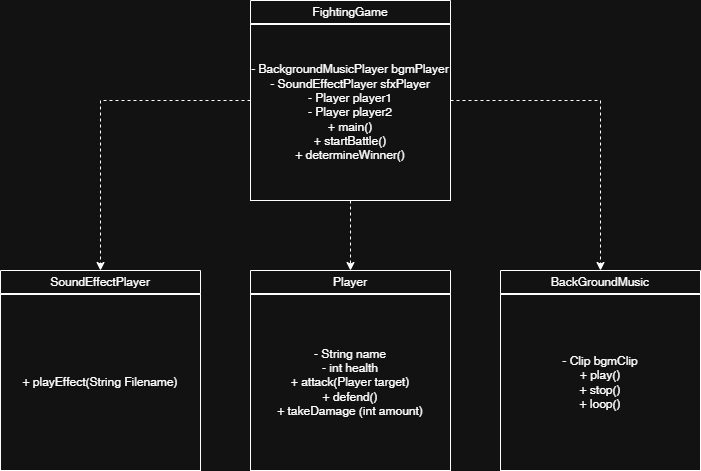

## JavaFightingGame

자바(Java) 기반으로 제작된 간단한 **콘솔 격투 게임**입니다.  
플레이어는 서로 공격/방어를 수행하며 체력이 0이 될 때까지 전투를 진행합니다. 
전투 중에는 **배경음악(BackgroundMusicPlayer)** 과 **효과음(SoundEffectPlayer)** 이 함께 동작합니다.

---

## 프로젝트 구조

| **FightingGame.java** | 메인 클래스. 캐릭터 생성, 공격/방어 로직, 승패 판정 담당. |
| **BackgroundMusicPlayer.java** | 배경음악을 재생/중지/루프 처리. |
| **SoundEffectPlayer.java** | 공격, 피격, 승리 등 이벤트에 맞는 효과음 재생. |
| **Player.java** | 플레이어의 이름, 체력, 공격/방어 동작 정의. |

---
## 클래스 다이어그램

> UML 다이어그램은 `FightingGame`이 중심 컨트롤러로서  
> `BackgroundMusicPlayer`, `SoundEffectPlayer`, `Player` 객체를 제어하는 구조입니다.

---

## 만든 사람

황준현, 임상규